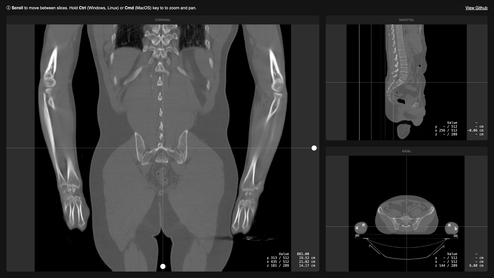

   

  [Live version](https://vangelov.github.io/slice-viewer/)

## Motivation

I wanted to learn more how these types of UIs worked and the best way to do it is to try to implement it yourself. 

## Scan Data
I'm using the sample CT scan from [here](https://github.com/SlicerRt/SlicerRtData/tree/master/aria-phantom-contours-branching). It's convereted to a custom format that's easier to deal with than DICOM. In the future it will definitely be useful if a third party library can be used to import any DICOM.

## Dependecies 
Apart from React, the app depends on [PicoGL](https://tsherif.github.io/picogl.js/) as a very thin layer on top of WebGL and [zip.js](https://gildas-lormeau.github.io/zip.js/) for unzippig the volume data. I decided to just compress the volume data as it was the fastest solution to get below the 100mb limit for files in Github in this case, but this won't work for larger volumes. 

## Implementation
Each viewport is consists of several layers from bottom to top:

- **Anatomy**: Uses a separate WebGL context to render a single slice of the volume depending on the plane (axial, saggital, coronal).
- **Lines**: Shows where the other 2 planes are.
- **Handles** (when the cursor is over the viewport): Allows to move a single plane from another viewport.
- **Info**: Shows information for the current cursor position.

All viewports and their layers are memoized so they only re-rendered when necessary.

The ap state is just a `useState` that's injected with a context. Reading from and writing to the state is done with custom hooks.

### 

## Scripts

In the project directory, you can run:

#### `npm run dev`
Runs the app in the development mode.\
Open [http://127.0.0.1:5173/](http://127.0.0.1:5173/) to view it in the browser.

#### `npm run build`
Builds the app for production in the `dist` folder.

