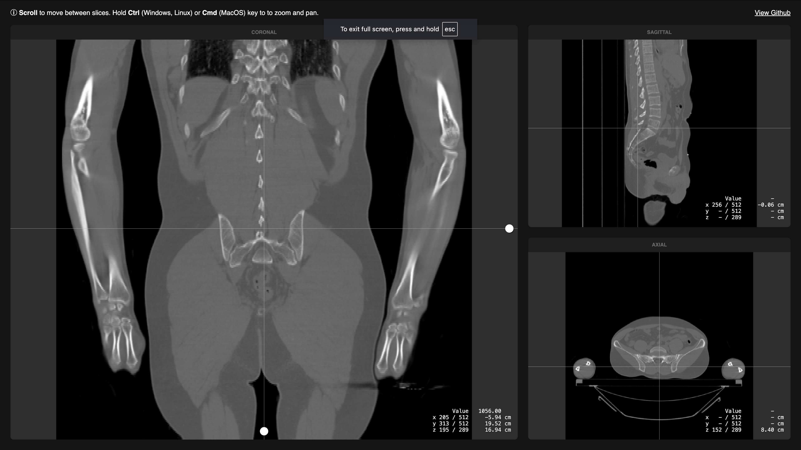

   

  [Live version](https://vangelov.github.io/slice-viewer/)

## Motivation

I wanted to learn more how these types of UIs worked and the best way to do it is to try to implement it yourself.

## Scan Data
I'm using the sample CT scan from [here](https://github.com/SlicerRt/SlicerRtData/tree/master/aria-phantom-contours-branching), but converted to an internal format. 

## Dependecies 
Apart from React, the app depends on [PicoGL](https://tsherif.github.io/picogl.js/) as a very thin layer on top of WebGL and [zip.js](https://gildas-lormeau.github.io/zip.js/) for unzippig the volume data.

## Scripts

In the project directory, you can run:

#### `npm run dev`
Runs the app in the development mode.\
Open [http://127.0.0.1:5173/](http://127.0.0.1:5173/) to view it in the browser.

#### `npm run build`
Builds the app for production in the `dist` folder.

